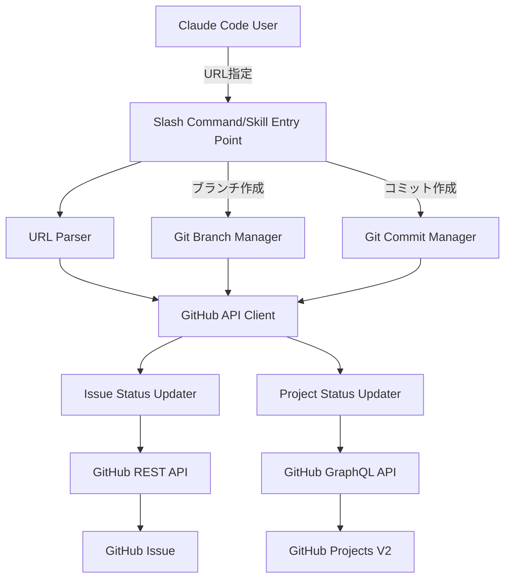

# 設計書: GitHub Issue Status Auto Update

## Overview

Claude CodeのSlash CommandまたはSkillを使用して、GitHubのissueステータスを自動的に「TODO」から「IN_PROGRESS」に更新する機能を提供します。開発者がブランチ作成やコミット作成といった作業開始のアクションを行う際に、GitHub issue URLを指定することで、シームレスにissueステータスを更新できます。

この機能は以下の3つの主要なユースケースに対応します：
1. Slash Commandによる単独のステータス更新
2. ブランチ作成と同時のステータス更新
3. コミット作成と同時のステータス更新

また、GitHub Projects V2のステータスフィールドにも対応し、issueが複数のプロジェクトに関連付けられている場合でも正しく更新します。

## Architecture

システムは以下のコンポーネントで構成されます：



### アーキテクチャの特徴

- **モジュラー設計**: URL解析、GitHub API操作、Git操作を独立したコンポーネントとして分離
- **エラーハンドリング**: 各レイヤーで適切なエラーハンドリングを実装し、ユーザーに明確なフィードバックを提供
- **拡張性**: 将来的に他のステータス遷移（IN_PROGRESS → DONE等）にも対応可能な設計
- **GitHub CLI活用**: `gh` CLIを使用することで、認証管理とAPI操作を簡素化

## Components and Interfaces

### 1. Slash Command Entry Point

**ファイル:** `.claude/commands/update-issue-status.md`

**インターフェース:**
```
/update-issue-status [GitHub Issue URL] [options]

options:
  --branch <branch-name>  新しいブランチを作成してからステータスを更新
  --commit                最初のコミット後にステータスを更新
```

**責務:**
- ユーザー入力の受け取り
- オプション解析
- 適切なコンポーネントへの処理委譲
- 実行結果のユーザーへのフィードバック

### 2. Skill Entry Point（オプション）

**ファイル:** `.claude/skills/github-issue-manager/skill.md`

**インターフェース:**
Skillとして提供する場合、より対話的なインターフェースを提供：
- Claude Codeとの自然言語対話でissue URLを取得
- ブランチ名の提案
- ステータス更新の確認

### 3. URL Parser

**責務:**
- GitHub issue URLの検証
- URLからowner、repository、issue numberの抽出
- エラー処理（無効なURL形式の検出）

**入力:** `https://github.com/owner/repo/issues/123`
**出力:**
```json
{
  "owner": "owner",
  "repo": "repo",
  "issueNumber": "123"
}
```

### 4. GitHub API Client

**責務:**
- `gh` CLIを使用したGitHub API操作のラッパー
- 認証状態の確認
- REST APIとGraphQL APIの両方に対応

**主要メソッド:**
- `checkAuth()`: 認証状態を確認
- `getIssue(owner, repo, issueNumber)`: Issue情報を取得
- `getIssueProjects(owner, repo, issueNumber)`: Issueが関連付けられているプロジェクトを取得
- `executeGraphQL(query)`: GraphQLクエリを実行

### 5. Issue Status Updater

**責務:**
- Issueの現在のステータスを確認
- ステータスが「TODO」の場合のみ「IN_PROGRESS」に更新
- GitHub Projects V2のステータスフィールド更新

**処理フロー:**
1. Issue情報を取得
2. 現在のステータスを確認
3. 既に「IN_PROGRESS」の場合は処理をスキップ
4. 「TODO」の場合、GraphQL APIを使用してステータスを更新
5. 複数のプロジェクトに関連付けられている場合、すべて更新

### 6. Project Status Updater

**責務:**
- GitHub Projects V2のGraphQL APIを使用したステータス更新
- プロジェクトのステータスフィールドIDの取得
- ステータスオプションの検索（「TODO」「IN_PROGRESS」の対応）

**GraphQL操作:**
```graphql
mutation UpdateProjectV2ItemFieldValue($projectId: ID!, $itemId: ID!, $fieldId: ID!, $value: ProjectV2FieldValue!) {
  updateProjectV2ItemFieldValue(input: {
    projectId: $projectId
    itemId: $itemId
    fieldId: $fieldId
    value: $value
  }) {
    projectV2Item {
      id
    }
  }
}
```

### 7. Git Branch Manager

**責務:**
- 新しいブランチの作成
- ブランチ作成後のステータス更新トリガー

**処理フロー:**
1. ブランチ名の検証
2. `git checkout -b <branch-name>`を実行
3. ブランチ作成成功後、Issue Status Updaterを呼び出し

### 8. Git Commit Manager

**責務:**
- コミット作成のサポート
- コミット後のステータス更新トリガー

**処理フロー:**
1. ステージされたファイルの確認
2. コミット実行（Claude Codeのデフォルトコミット機能を利用）
3. コミット成功後、Issue Status Updaterを呼び出し

## Data Models

### IssueInfo

```typescript
interface IssueInfo {
  owner: string;          // リポジトリオーナー
  repo: string;           // リポジトリ名
  issueNumber: number;    // Issue番号
  currentStatus: string;  // 現在のステータス（GitHub Projects V2から取得）
  projectItems: ProjectItem[];  // 関連するプロジェクトアイテム
}
```

### ProjectItem

```typescript
interface ProjectItem {
  projectId: string;       // プロジェクトID
  itemId: string;          // プロジェクト内のアイテムID
  statusFieldId: string;   // ステータスフィールドのID
  statusOptions: {         // ステータスオプション
    todo: string;          // TODOのオプションID
    inProgress: string;    // IN_PROGRESSのオプションID
  };
}
```

### CommandOptions

```typescript
interface CommandOptions {
  issueUrl: string;           // GitHub Issue URL
  createBranch?: string;      // 作成するブランチ名（オプション）
  triggerOnCommit?: boolean;  // コミット後にトリガーするか（オプション）
}
```

## Error Handling

### エラーの種類と対応

1. **URL検証エラー**
   - **原因:** 無効なGitHub issue URL形式
   - **メッセージ:** "エラー: 無効なGitHub issue URLです。正しい形式: https://github.com/owner/repo/issues/123"
   - **処理:** 処理を中断し、ユーザーに再入力を促す

2. **認証エラー**
   - **原因:** GitHub CLIの認証が未完了
   - **メッセージ:** "エラー: GitHub認証が必要です。`gh auth login`を実行してください。"
   - **処理:** 処理を中断し、認証方法を案内

3. **Issue不存在エラー**
   - **原因:** 指定されたissueが存在しない
   - **メッセージ:** "エラー: Issue #123 が owner/repo に存在しません。"
   - **処理:** 処理を中断し、URLの確認を促す

4. **権限エラー**
   - **原因:** リポジトリまたはプロジェクトへのアクセス権限がない
   - **メッセージ:** "エラー: リポジトリまたはプロジェクトへのアクセス権限がありません。"
   - **処理:** 処理を中断し、権限の確認を促す

5. **Git操作エラー**
   - **原因:** ブランチ作成またはコミット作成に失敗
   - **メッセージ:** "エラー: ブランチの作成に失敗しました: [詳細エラーメッセージ]"
   - **処理:** Issue更新を実行せず、エラーを報告

6. **ステータスフィールド不存在エラー**
   - **原因:** プロジェクトにステータスフィールドが存在しない
   - **メッセージ:** "警告: プロジェクト [プロジェクト名] にステータスフィールドが存在しません。スキップします。"
   - **処理:** 該当プロジェクトの更新をスキップし、他のプロジェクトは処理継続

7. **GraphQL APIエラー**
   - **原因:** GitHub GraphQL APIの呼び出しに失敗
   - **メッセージ:** "エラー: GitHub APIの呼び出しに失敗しました: [APIエラーメッセージ]"
   - **処理:** 処理を中断し、エラー詳細を表示

### エラーハンドリング戦略

- すべてのエラーメッセージは日本語で提供
- エラー発生時は処理を適切に中断し、部分的な更新を避ける
- ただし、複数プロジェクト更新時は、1つのプロジェクト更新失敗でも他は継続
- エラーログには詳細情報を含め、デバッグを容易にする

## Testing Strategy

### 単体テスト（Unit Tests）

各コンポーネントを独立してテスト：

1. **URL Parser Tests**
   - 有効なURL形式の解析テスト
   - 無効なURL形式の検出テスト
   - エッジケース（異なるGitHub URL形式）のテスト

2. **GitHub API Client Tests**
   - モックAPIレスポンスを使用した認証確認テスト
   - Issue情報取得のテスト
   - GraphQL実行のテスト
   - エラーハンドリングのテスト

3. **Issue Status Updater Tests**
   - ステータスが「TODO」の場合の更新テスト
   - ステータスが既に「IN_PROGRESS」の場合のスキップテスト
   - 複数プロジェクト更新のテスト

### 統合テスト（Integration Tests）

コンポーネント間の連携をテスト：

1. **Slash Command → Status Update Flow**
   - コマンド入力から完了までのフロー全体
   - エラー時の適切なフィードバック確認

2. **Branch Creation + Status Update Flow**
   - ブランチ作成成功時のステータス更新確認
   - ブランチ作成失敗時のステータス未更新確認

3. **Commit + Status Update Flow**
   - コミット成功時のステータス更新確認
   - コミット失敗時のステータス未更新確認

### E2Eテスト（End-to-End Tests）

実際のGitHub環境を使用したテスト：

1. **テスト用リポジトリとプロジェクトの準備**
   - GitHub上にテスト用リポジトリを作成
   - Projects V2でテストプロジェクトを作成
   - ステータスフィールド（TODO、IN_PROGRESS、DONE）を設定

2. **実際のシナリオテスト**
   - 実際のissue URLを使用したステータス更新
   - 複数プロジェクト関連付けissueの更新
   - ブランチ作成フローの完全テスト
   - コミット作成フローの完全テスト

3. **エラーシナリオテスト**
   - 存在しないissue URLでのエラー確認
   - 権限のないリポジトリでのエラー確認
   - 無効なURL形式でのエラー確認

### テストツール

- **Bash Script Testing**: `bats`（Bash Automated Testing System）を使用
- **モッキング**: `gh` CLIのモック実装を作成
- **CI/CD**: GitHub Actionsでテストを自動実行

### テストカバレッジ目標

- 単体テスト: 80%以上のコードカバレッジ
- 統合テスト: 主要フローの100%カバー
- E2Eテスト: すべてのユースケースと主要なエラーシナリオをカバー
